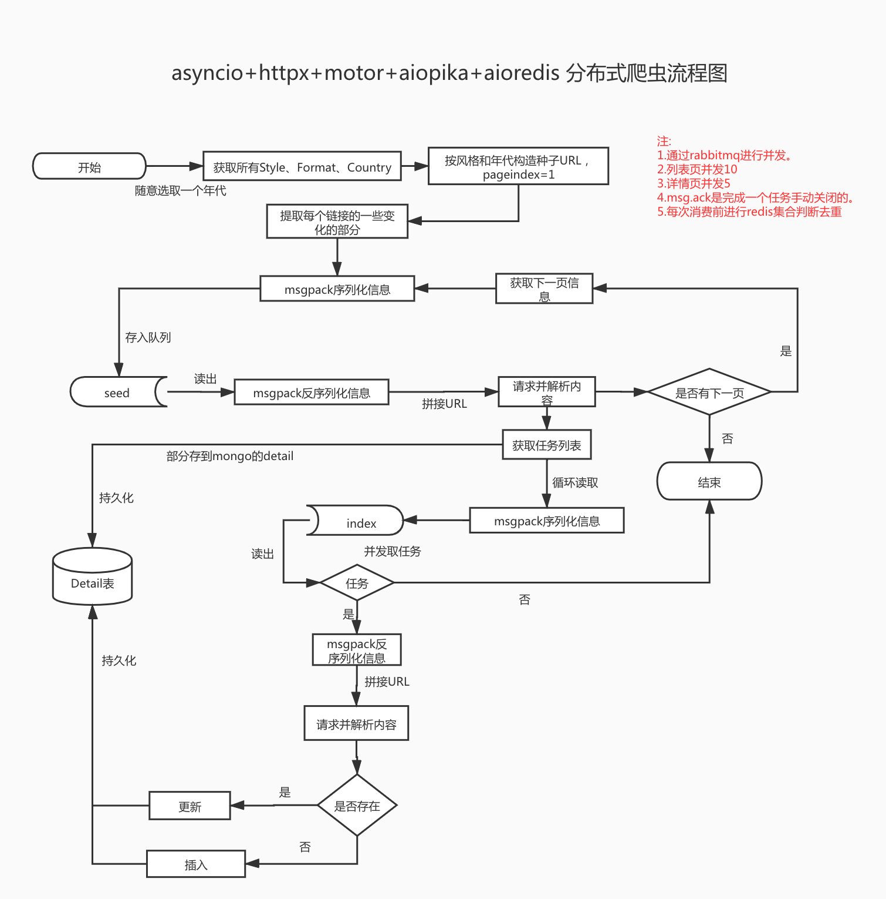

# Crawl a foreign vinyl record information website(Discogs), use Asyncio+Httpx+Motor+Aio-Pika+Aioredis in Python3.8


### Project flow chart


## How to run?

### install  poetry
```
python3 -m pip install poetry
```
### init environment	
```
poetry init
```
### install dependencies
```
poetry install 
```

### Run
```
poetry run python main.py
```


Attention:
Step1 must generate task queue first, otherwise step2 will go wrong. 

Similarly, step3 must wait for step2 to generate a task queue.
The call between files can be optimized according to actual business conditions.(Where step1, step2, step3 are aliases of functions)
### About Code
Using some of the new features of python, you can learn some new usages,
such as: typing, fstring, pydantic, dataclass
How to develop asynchronous programming, 
the scheduling relationship between codes,the use of decorators, etc.

### Introduction to the use of storage tools
- redis: remove duplication
- rabbitmq: Conducive to its message confirmation mechanism
- mongo: data persistence

### Bug?
- In step1, an error will be reported when using step2 and step3, so multiple processes are used, and the optimization will be continued later to find solutions.
- pydantic can't completely replace dataclass, there will be errors in some places, whether follow-up investigation can be solved.
- There are some typing that has not been added and will be completed later.

Of course, the level is limited, and there are many areas that need to be optimized. Welcome to discuss with me.
### Contact Me
- Wechat : italocxa 
- GZH : python学习开发
- ZhiHu : https://www.zhihu.com/people/muzico425/columns
- cnblogs : https://www.cnblogs.com/c-x-a/